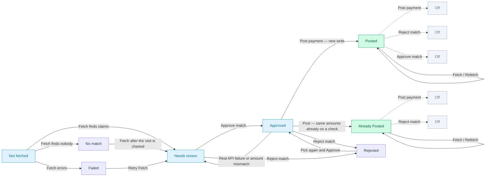
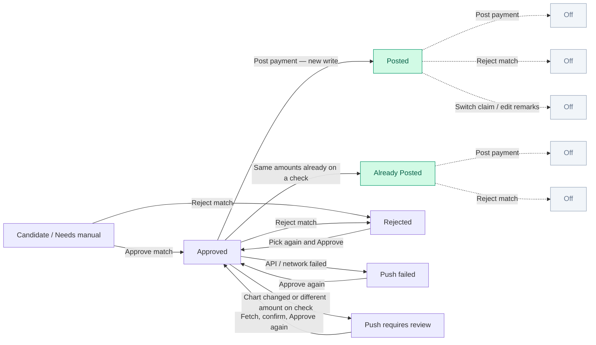
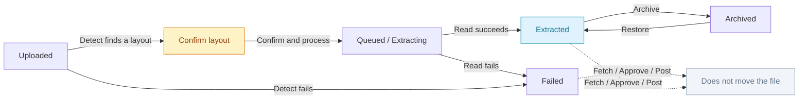

# Statuses — what changes when

Statuses describe **where the work is**, not whether anyone did a bad job. Ordo shows status in three places that people mix up:

1. **The file** (EOB Dashboard row) — did we read the PDF?
2. **The patient** (inside a file, or on Patients) — did we fetch, approve, post?
3. **The match** (Open Dental tab) — is this claim locked, posted, or stuck?

A file can be **Extracted** while Maria is still **Not fetched** and James is already **Posted**. That is normal: the file is the envelope; the people inside it move at different speeds.

The tables below answer **what you can click** at each status. Fetch, Approve, Post, and Reject also need the matching permission on your role.

In the app, **Workflow guide** (on the EOB patient list) is a short version of this page.

Solid arrows are **allowed**. Dashed arrows are **not allowed** (the button is off, or the action does not change that status).

<p class="status-legend">
  <span><i></i> Allowed</span>
  <span><i class="blocked"></i> Not allowed / does not change this status</span>
</p>

---

## Status map

### Patient — what is possible



**Posted** and **Already Posted** are both the end of the line. Fetch still runs, but it does not take Maria back to Needs review, and it does not turn **Post payment** back on. **Already Posted** means Open Dental already had matching amounts on a check — that is success, not a bug.

### Match — Open Dental tab



After **Push failed** or **Push requires review**, **Post payment** stays off until you **Approve match** again. Messages like *Cannot change InsPayAmt…attached to a ClaimPayment* with **matching** amounts become **Already Posted**, not Push failed.

### File — the envelope on the dashboard



A file can stay **Extracted** while Maria is **Posted** and James is **No match**. That is expected.

If you **Reject match**, the patient becomes **Rejected**. The file stays **Extracted**.

---

## File statuses (EOB Dashboard)

These are the words on the **file** row and on the dashboard tabs.

| You see | What it means | What you do |
| --- | --- | --- |
| **Uploaded** | The file arrived. Reading has not finished. | Wait, or open if it sits here. |
| **Confirm layout** | Ordo detected the remittance type (payer/layout) but has not extracted patients yet. | Open the file → **Confirm & process**, or use **Process {payer}** / **Process EOB** on the row ⋯ menu. There is no separate Confirm layout filter tab — look under Active / Uploaded. |
| **Queued** | Waiting its turn to be read. | Wait. Refresh if it sits here a long time. |
| **Extracting** | Ordo is reading the PDF right now. | Wait. Do not post from this file yet. |
| **Extracted** | Patients and lines are ready. | Open the file. Fetch, review, post. |
| **Failed** | Reading (or a rare later file-level error) did not succeed. | Open the row, read the message. See [Errors](../errors/index.md). |
| **Archived** | Hidden from Active and from Reports. Not deleted. | Restore if that was a mistake. |
| **Retry required** | Try the failed step again after the underlying problem is fixed. | Read the message; often a post or connection issue. |

Older or internal labels you might hear from support (same idea, different word):

| Internal name | On screen |
| --- | --- |
| `uploaded` / `queued` / `extracting` | Uploaded / Queued / Extracting |
| `awaiting_confirm` | **Confirm layout** |
| extraction `completed` | **Extracted** |
| `failed` | Failed |
| `archived` | Archived |

!!! note "Review is not a file status"
    **Needs review**, **Approved**, **Posted**, and **Already Posted** live on the **patient**, not on the envelope. The dashboard “Pending review” card is a count of work still to do, not a file-row label.

### What moves the file

| Operation | File status |
| --- | --- |
| Upload + detect | Uploaded → **Confirm layout** (when layout is known) |
| Confirm & process | Confirm layout → Queued / Extracting → **Extracted** |
| Extraction fails | **Failed** |
| Archive | **Archived** |
| Restore | Back to Active (usually Extracted) |
| Fetch / Approve / Post | **Does not change the file row** |

**Example.** Jennifer uploads Monday’s Cigna. The row shows **Confirm layout · Detected Cigna**. She opens the file, clicks **Confirm & process**, and the row becomes Extracted. Mike fetches and posts all three patients. The dashboard still says **Extracted** on the file — that is correct. Posted is a *person* status. Reports still count the posted payments.

---

## Patient statuses (inside an EOB)

These are the badges on each **person** in the file.

| You see | What it means | Typical next step |
| --- | --- | --- |
| **Not fetched** | You have not clicked **Fetch Open Dental** for this person. | Tick the row, Fetch, then open. |
| **Pending** | Matching has not produced a decision yet (rare on a fetched row). | Fetch if you have not; otherwise open the patient. |
| **Needs review** | Candidates exist, or identity checks need a person. | Open **Open Dental** and **Audit**. |
| **Approved** | Someone confirmed the Open Dental claim. Money is **not** posted. | Someone with Post payment clicks **Post payment**. |
| **Posted** | Ordo wrote the payment to Open Dental (or simulated in Demo). | Done for this person. **Post payment** is off. |
| **Already Posted** | Open Dental already had the **same** amounts on a check. Ordo did not treat this as a failure. | Done for this person — same locks as **Posted**. |
| **Rejected** | Match was thrown away. | Another candidate, post by hand in Open Dental, or leave it. |
| **No match** | Fetch ran; no plausible Open Dental claim. | Search the chart; Sync; enter the claim in Open Dental if it was never charted. |
| **Failed** | Fetch (or a later Open Dental call for this person) errored. | Retry Fetch. Check API Logs. Do **not** confuse this with **Already Posted**. |

### What moves the patient

| Operation | Patient status |
| --- | --- |
| Open file (no fetch) | Stays **Not fetched** |
| Fetch finds claims | **Needs review** (unless already approved/posted/rejected) |
| Fetch finds nobody | **No match** |
| Fetch API error | **Failed** |
| Approve match | **Approved** |
| Post succeeds (new write) | **Posted** |
| Post finds matching amounts already on a ClaimPayment | **Already Posted** |
| Post: chart changed, or attached check has a **different** amount | Back toward **Needs review** (match: **Push requires review**) |
| Post: real API / network failure | **Needs review** (match: **Push failed**) — approve again before posting |
| Reject match | **Rejected** |

**Posted**, **Already Posted**, **Approved**, and **Rejected** win over fetch: refetching Maria after she is Posted does not take her back to Needs review.

### What you can do on the patient row

| Patient status | Fetch / Refetch | Approve match | Post payment | Reject match |
| --- | --- | --- | --- | --- |
| **Not fetched** | Fetch | No — fetch first | No | No — nothing to reject yet |
| **Needs review** | Yes | Yes, unless hard mismatch | No — approve first | Yes |
| **Approved** | Yes (does not undo approve) | Already done | **Yes** | Yes |
| **Posted** | Yes (does not undo posted) | No | **No** — already posted | **No** |
| **Already Posted** | Yes (does not undo) | No | **No** — already on the check | **No** |
| **Rejected** | Yes | Yes — pick again | No | Already rejected |
| **No match** | Yes | No — no claim to approve | No | No |
| **Failed** | Yes — retry | No until fetch succeeds | No | No |

The Open Dental tab buttons follow the **match** status in the next section. If a patient has more than one claim, the row uses the “furthest along” rule: all posted / already posted → **Posted** or **Already Posted**; all approved or posted → **Approved**.

**Example.** Mike fetches Maria and James. Maria becomes Needs review. James is No match (no chart claim). Mike approves Maria. Jennifer posts Maria → Posted. James is still No match until someone charts the visit in Open Dental and Mike fetches again.

---

## Match statuses (Open Dental tab)

These describe **this EOB claim vs that Open Dental claim**. You see them as banners, disabled buttons, and the post-result popup more than as a second badge.

### How the match status changes

```
Fetch Open Dental
    → Candidate found   (Ordo listed claims — you still confirm)
    → Needs manual      (Ordo wants a person to pick)

Approve match
    → Approved          (claim locked in Ordo; money not written yet)

Post payment
    → Posted                    (Ordo wrote new amounts)
    → Already Posted            (Open Dental already had the same amounts on a check — success)
    → Push failed               (real API / network failure — not the attached-check case)
    → Push requires review      (the chart changed after approve, or attached check has a different amount)

Reject match
    → Rejected
```

After **Posted** or **Already Posted**, **Post payment** and **Reject match** are off, and remarks are read-only. If Open Dental already had the same amounts on a check, Ordo skips changing `InsPayAmt` and shows **Already Posted** — that is not a failure. After **Push failed** or **Push requires review**, **Post payment** is off until you **Approve match** again.

### What you can click

You also need the matching **permission** (Approve match, Post payment, Reject match). If your role does not include it, the button is missing.

| Match status | Switch claim | Edit remarks | Approve match | Post payment | Reject match |
| --- | --- | --- | --- | --- | --- |
| **Candidate found** | Yes | Yes | Yes, unless **Hard mismatch** | No — approve first | Yes |
| **Needs manual** | Yes | Yes | Yes, after you pick a safe candidate | No — approve first | Yes |
| **Approved** | Yes | Yes | Hidden (already done) | **Yes** | Yes |
| **Posted** | No | No (read-only) | Hidden | **No** — already done | **No** |
| **Already Posted** | No | No (read-only) | Hidden | **No** — already on the check | **No** |
| **Rejected** | Yes | Yes | Yes — pick again and approve | No | Yes |
| **Push failed** | Yes | Yes | **Yes** — approve again before a new post | No until you approve again | Yes |
| **Push requires review** | Yes | Yes | **Yes** — fetch, confirm, approve again | No until you approve again | Yes |

**Hard mismatch** is a flag on a candidate, not a status. Approve stays disabled for that claim. Pick another claim or reject. The patient row can still say **Needs review**.

Open Dental API calls for fetch, reject, and post live on the patient’s **Audit** tab. After **Post payment**, a popup reports **Posted**, **Already Posted**, or the error, with a **View audit** link.

---

## Line statuses (procedure table)

On the Open Dental tab, each EOB line has its own **Status** column. That is not the patient badge.

| Line status | Meaning |
| --- | --- |
| **Match** | The CDT code mapped to an Open Dental claim procedure. |
| **Differs** / **Not matched** | No matching Open Dental procedure on this claim. |

After a successful **Post payment**, remarks freeze (read-only). **Post payment** and **Reject match** stay off.

---

## Open Dental’s own statuses (what Ordo writes)

You do not set these by hand in Ordo. They matter when you look at the chart after a post, or when API Logs mention them.

### Claim status (the whole visit)

Open Dental uses a letter. After a successful post, Ordo sets the claim to **Received**.

| Code | Word | Meaning in the office |
| --- | --- | --- |
| **U** | Unsent | Not sent to insurance yet. |
| **H** | Hold until primary received | Waiting on another plan. |
| **W** | Waiting in queue | In the send queue. |
| **S** | Sent | Sent to the payer. |
| **R** | Received | Insurance payment recorded. **This is what Ordo sets on post.** |
| **I** | Hold for in process | Held in the office workflow. |

### Procedure (ClaimProc) status

| Word Ordo sends | Meaning |
| --- | --- |
| **NotReceived** | Estimate / not paid yet. |
| **Received** | Insurance paid amount is on this line. **This is what Ordo sets on post** (unless the line is already attached to a check — then Ordo does not change status or `InsPayAmt`). |
| **Supplemental** | Extra payment after the first receive. |
| **Estimate** / **Adjustment** / capitation types | Special rows Ordo does not treat as a normal EOB line to post. |

If Open Dental already has the line on a check with the **same** `InsPayAmt`, Ordo skips that write and shows **Already Posted**. That is success — not Failed. If the attached check has a **different** amount, post stops and asks you to review. Open Dental will **refuse** a new `InsPayAmt` on an attached line; Ordo maps the matching-amount case to **Already Posted** instead of treating the 400 as a sync failure. See [Open Dental errors](../errors/open-dental.md).

---

## Connection and sync statuses

On **Clinic settings → PMS Integrations**:

| You might see | Meaning |
| --- | --- |
| Connected, last sync time, patient/claim counts | Replica is usable for Fetch. |
| Last sync **failed** plus an error | Sync did not finish. Test the connection; read API Logs. |
| Not connected | Fetch in Actual cannot load live charts. |

Test connection does not change patient rows. It only proves the keys.

---

## Worked example — Maria Santos, one Monday

**File:** `Cigna_Remit_Aug24.pdf`

| Time | What someone did | File | Maria |
| --- | --- | --- | --- |
| 8:07 | Jennifer uploads with **Detect & upload**, then **Process EOB** | Confirm layout → Extracting → Extracted | Not fetched |
| 8:12 | Mike ticks Maria, Fetch | Extracted | Needs review |
| 8:14 | Mike approves claim 18421 | Extracted | Approved |
| 8:18 | Jennifer posts | Extracted | Posted |

James Lee on the same file stays **No match** the whole morning. The file never becomes “Posted” as a whole — and that is fine.

---

## Related pages

- [What each operation does](operations.md)
- [Open Dental errors](../errors/open-dental.md)
- [Inside an EOB](../modules/working-an-eob.md)
- [Word list](../glossary.md)
